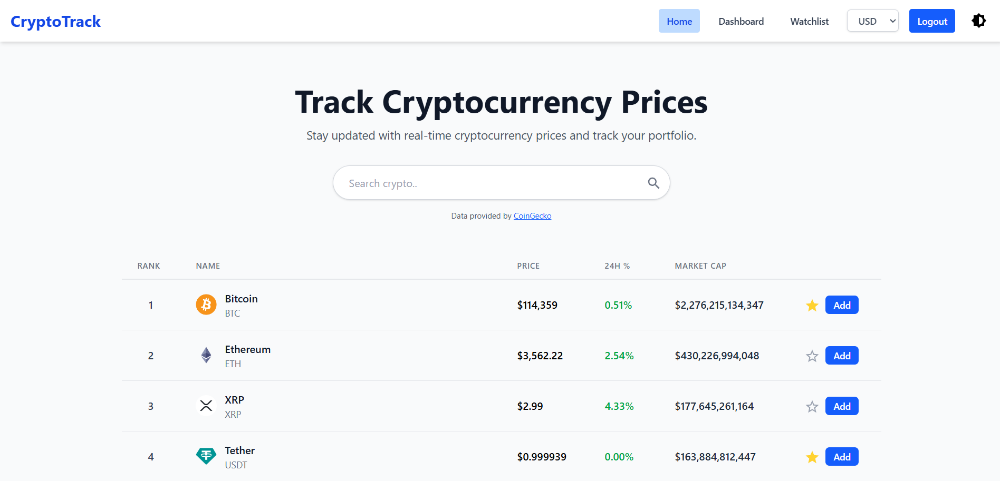
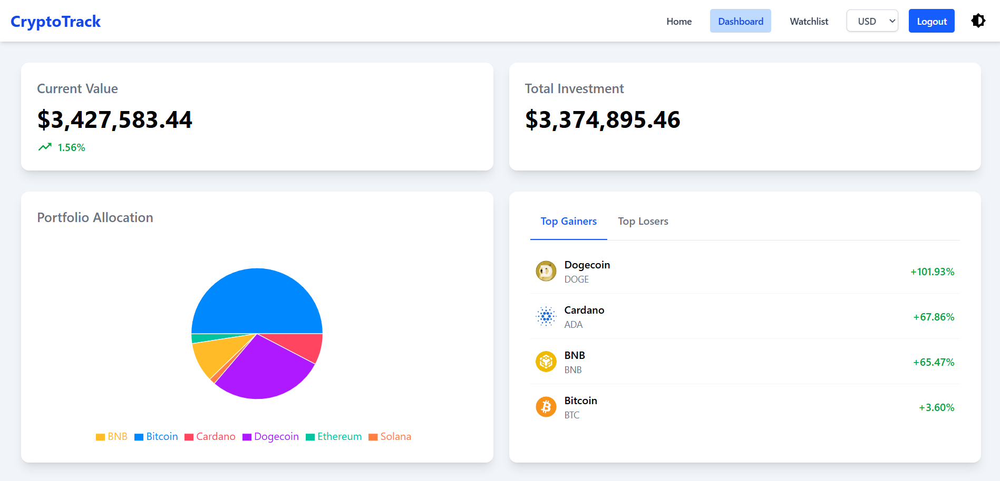
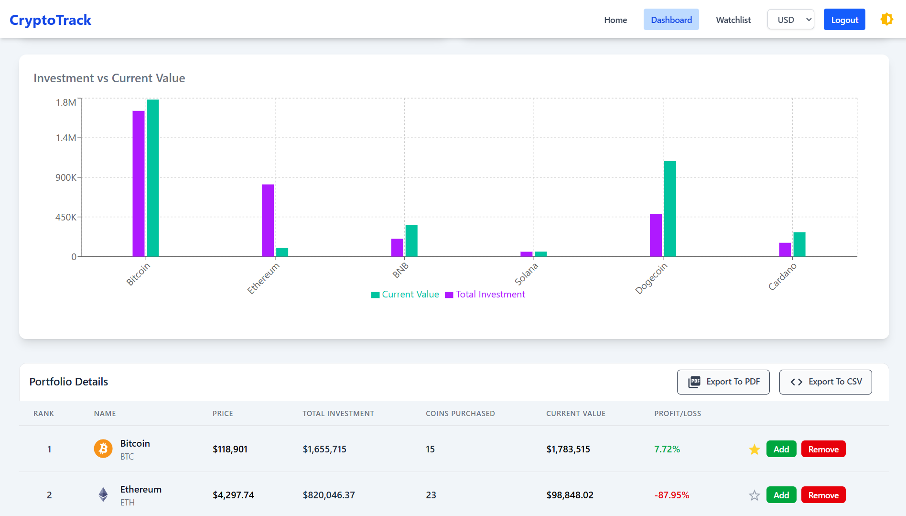
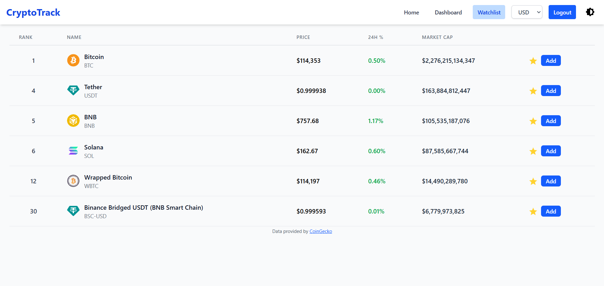
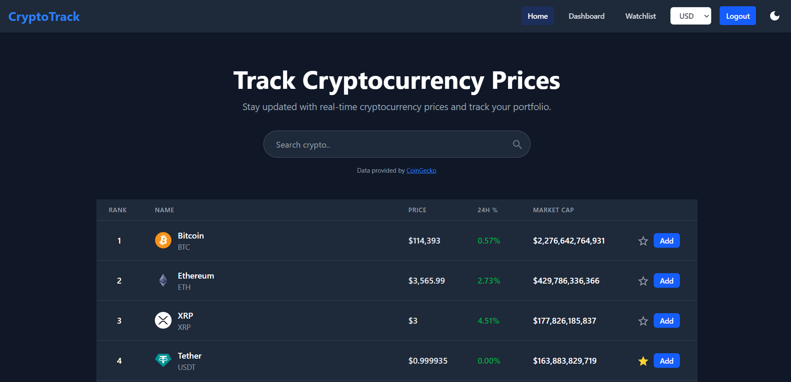
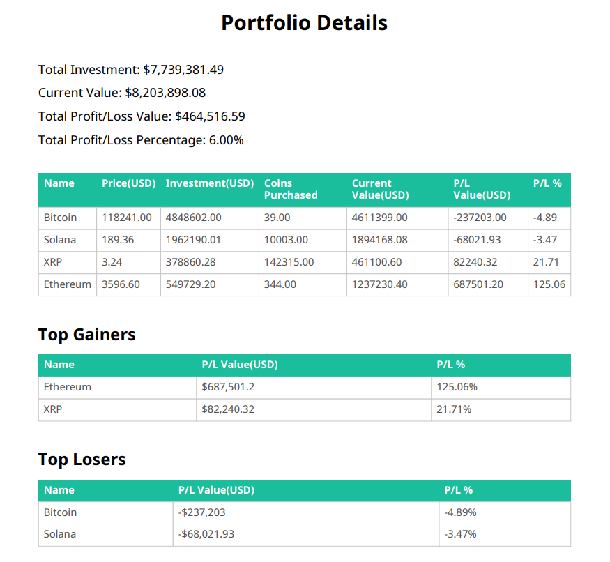
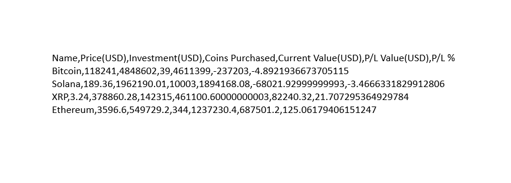

# CryptoTrack

A web application to track real-time cryptocurrency prices, manage a personal portfolio, and maintain a watchlist of favorite coins.

## Table of Contents

- [Description](#description)
- [Live Demo](#live-demo)
- [Features](#features)
- [Tech Stack](#tech-stack)
- [Screenshots](#screenshots)
- [Getting Started](#getting-started)
- [Key Attributions](#Key Attributes)
## Description

CryptoTrack is a web application that allows users to track real-time cryptocurrency prices, manage their portfolio, and maintain a watchlist. Users can register, log in, add/remove coins to their portfolio or watchlist, and export their portfolio data as PDF or CSV reports. This project was developed as part of an internship at Ultimez Technology Pvt Ltd.

## Features

- User authentication (register, login, logout)
- Real-time cryptocurrency prices (via CoinGecko API)
- Search cryptocurrency
- Add/remove coins to portfolio and watchlist
- Portfolio performance analytics (profit/loss, allocation chart, top gainers, top losers)
- Export your portfolio report in both PDF and CSV formats.
- View portfolio values in different fiat currencies (via Frankfurter API)
- Dark mode support with theme persistence

## Tech Stack

The project is built with the MERN stack and other modern technologies:

- **Frontend:** React, Tailwind CSS
- **Backend:** Node.js, Express.js
- **Authentication:** JWT, Passport.js
- **APIs:** CoinGecko (crypto data), Frankfurter (currency conversion)
- **Key Libraries:**
    - `axios`: For making API requests.
    - `recharts`: For creating pie chart and bar chart.
    - `framer-motion`: For UI animations.
    - `jspdf` & `jspdf-autotable`: For generating PDF reports.
    - `React-toastify`: For alerts.

## Screenshots

### Home Page

Search and view top cryptocurrencies, add to watchlist or portfolio.

### Dashboard

<br>

View portfolio summary, allocation charts, and top gainers/losers.

### Watchlist

Manage your favorite coins.

### Dark Mode

Toggle between light and dark themes with persistent preference.

### Exported PDF

Downloadable portfolio report in PDF format.

### Exported CSV

Downloadable portfolio report in CSV format.

## Getting Started

Follow these instructions to set up and run the project locally on your machine.

### Prerequisites

- Node.js (v18 or later recommended)
- Git

### 1. Clone the Repository

```bash
git clone https://github.com/JoyM268/CryptoTrack.git
cd CryptoTrack
```

### 2. Backend Setup

Navigate to the server directory and install dependencies.

```bash
cd Server
npm install
```

#### Environment Variables

Create a `.env` file in the `Server` directory and add the following variables.

```env
PORT=3000
CLIENT="http://localhost:5173"
JWT_SECRET="YOUR_JWT_SECRET"
```

#### Run the Backend Server

```bash
npm start
```

### 3. Frontend Setup

In a new terminal, navigate to the client directory and install dependencies.

```bash
# From the root CryptoTrack directory
cd Client
npm install
```

#### Environment Variables

Create a `.env` file in the `Client` directory and add the following:

```env
VITE_API_URL="http://localhost:3000"
```

#### Run the Frontend

```bash
npm run dev
```

The application should now be running at **http://localhost:5173**.

## Key Attributes

- Cryptocurrency data provided by [CoinGecko API](https://www.coingecko.com/en/api).
- Currency conversion powered by [Frankfurter API](https://www.frankfurter.app/).
